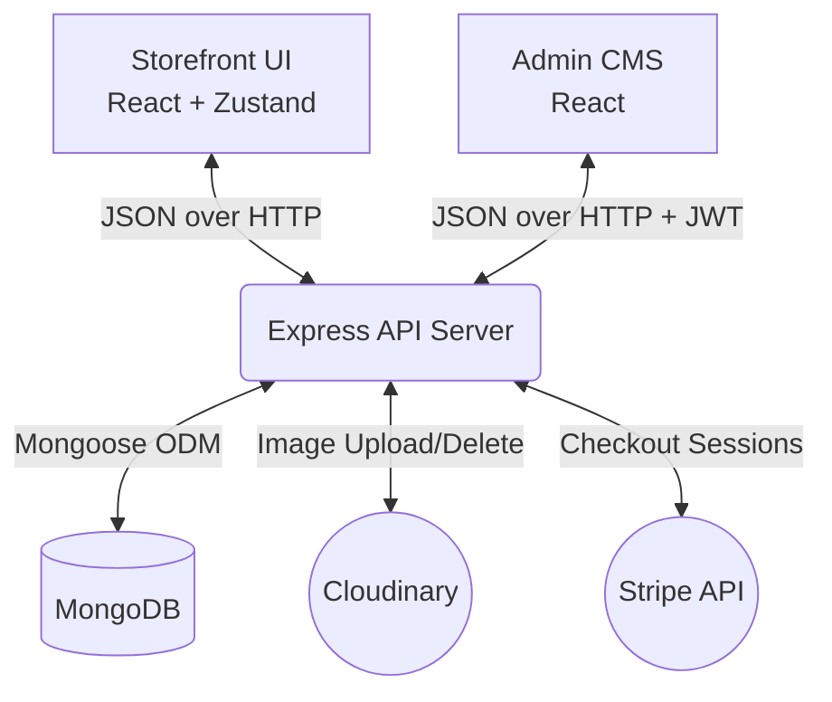

# 🛒 Forever - Full-Stack E-Commerce Platform


A production-ready, full-stack E-Commerce application built from the ground up using the **MERN** stack (MongoDB, Express, React, Node.js). 

This project was built to demonstrate a comprehensive understanding of modern web architecture, including a consumer-facing storefront, a secure RESTful API, and a dedicated admin Content Management System (CMS). It strongly emphasizes **performance optimization**, **clean code principles**, and **scalable state management**, making it a robust showcase of my full-stack capabilities as a developer.

---

## 🌟 Live Demos & Testing

- **Frontend Store:** [https://forever-frontend-xi-beryl.vercel.app/](https://forever-frontend-xi-beryl.vercel.app/)
- **Admin Panel:** [https://forever-admin-pi-pink.vercel.app/](https://forever-admin-pi-pink.vercel.app/)

> [!TIP]
> **Recruiter Testing Credentials:**
> You can log into both the **Frontend** and the **Admin Panel** using the following test account:
> - **Email:** `admin@forever.com`
> - **Password:** `12345678`

---

## 🏗️ System Architecture

The application follows a decoupled client-server architecture, divided into three main micro-apps:



### 1. Frontend (Customer Storefront)
Built with **React.js** and **Vite** for lightning-fast HMR and optimized builds.
- **State Management:** Utilizes **Zustand** (`useShopStore.js`) for lightweight, predictable, and boilerplate-free global state management (handling carts, user sessions, and product data).
- **Styling:** **Tailwind CSS** for a fully responsive, mobile-first UI design.
- **UX Features:** Real-time search, dynamic filtering, secure checkout flows, and toast notifications.

### 2. Backend (RESTful API)
Built with **Node.js** and **Express.js**, serving as the central nervous system.
- **Database Architecture:** **MongoDB** via **Mongoose**. Implements strict schemas for Users, Products, and Orders.
- **Authentication:** Custom **JWT-based** stateless authentication with bcrypt password hashing.
- **Media Storage:** Deeply integrated with **Cloudinary**. Includes automated memory management (e.g., when a product is deleted from the DB, the server automatically hooks into the Cloudinary API to permanently delete the associated images to prevent cloud storage leaks).
- **Payments:** Integrated with **Stripe** checkout sessions and webhook verification for secure transaction handling.

### 3. Admin Panel (CMS)
A secure, restricted dashboard for inventory management.
- **Product Management:** Full CRUD capabilities with support for `multipart/form-data` image uploads via **Multer**.
- **Order Management:** View real-time customer orders and update shipping statuses dynamically.

---

## 🚀 Performance Optimizations

As a developer, I prioritize not just making things work, but making them fast and scalable. Here are the architectural optimizations implemented in this project:

- **Database Indexing:** Added MongoDB indexes (`index: true`) to heavily queried fields (like `category`, `subCategory`, `userId`, and `stripeSessionId`) changing query time complexity from O(N) collection scans to O(log N).
- **In-Memory Caching:** Introduced server-side caching using `node-cache`. The heavily requested `/api/products` endpoint caches the entire catalog in RAM, bypassing the database entirely for subsequent requests to drastically reduce TTFB (Time To First Byte).
- **Lean Queries:** Replaced standard Mongoose queries with `.lean()` execution. By skipping the hydration of heavy Mongoose document instances for read-only API requests, server memory footprint was reduced by up to 5x.
- **Automated Data Seeding:** Developed a robust `resetDB.js` Node script that automates the wiping and re-seeding of MongoDB and Cloudinary, ensuring a reproducible development environment.

---

## 💻 Local Development Setup

Want to run this locally? Follow these steps:

### Prerequisites
- Node.js installed (`v18+` recommended)
- MongoDB account (Atlas cluster)
- Cloudinary and Stripe accounts (for API keys)

### 1. Clone the Repository
```bash
git clone https://github.com/SILLY-CODEER5/E-Commerce.git
cd E-Commerce
```

### 2. Backend Setup
```bash
cd backend
npm install
```
Create a `.env` file in the `backend` directory:
```env
PORT=4000
MONGODB_URI=your_mongodb_uri
JWT_SECRET=your_jwt_secret
ADMIN_EMAIL=admin@forever.com
ADMIN_PASSWORD=12345678
STRIPE_SECRET_KEY=your_stripe_secret_key
CLOUDINARY_NAME=your_cloudinary_name
CLOUDINARY_API_KEY=your_cloudinary_key
CLOUDINARY_API_SECRET_KEY=your_cloudinary_secret
```
Run the seed script to populate the database and start the server:
```bash
node scripts/resetDB.js
npm run server
```

### 3. Frontend Setup
```bash
cd ../frontend
npm install
```
Create a `.env` file in the `frontend` directory:
```env
VITE_BACKEND_URL=http://localhost:4000
```
Start the frontend app:
```bash
npm run dev
```

### 4. Admin Panel Setup
```bash
cd ../admin
npm install
```
Create a `.env` file in the `admin` directory:
```env
VITE_BACKEND_URL=http://localhost:4000
```
Start the admin panel:
```bash
npm run dev
```
